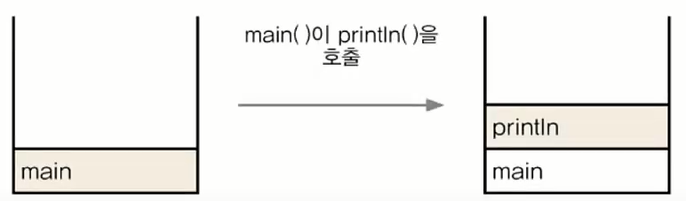
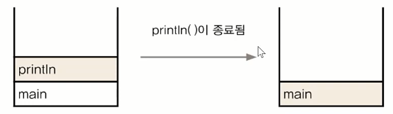
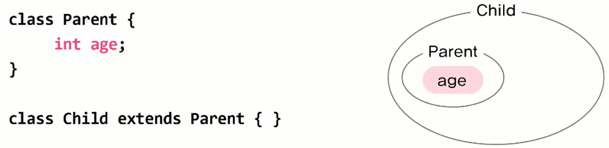
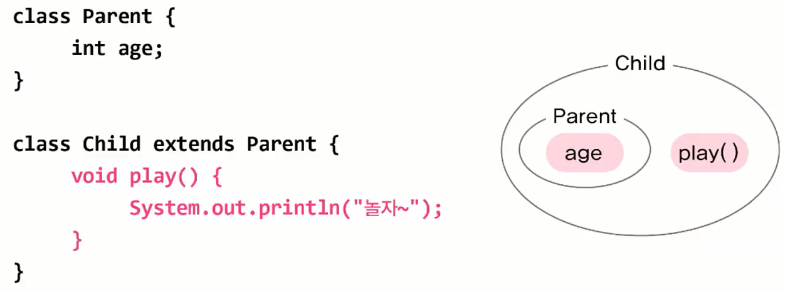

# Java-Foundation
- [자바의 특징](#자바의-특징)
- [JVM](#jvm)
- [Variable](#variable)
- [기본형과 참조형](#기본형과-참조형)
- [배열](#배열)
- [Arrays](#arrays)
- [객체지향](#객체지향)
- [객체 배열](#객체-배열)
- [호출 스택](#호출-스택)
- [매개변수](#매개변수)
- [static 메서드와 인스턴스 메서드](#static-메서드와-인스턴스-메서드)
- [오버로딩과 오버라이딩](#오버로딩과-오버라이딩)
    - [오버로딩 Overloading](#오버로딩-overloading)
    - [오버라이딩 Overriding](#오버라이딩-overriding)
- [생성자](#생성자)
    - [기본 생성자](#기본-생성자)
    - [생성자 this()](#생성자-this)
    - [참조변수 this](#참조변수-this)
    - [참조변수 this와 생성자 this](#참조변수-this와-생성자-this)
    - [참조변수 super](#참조변수-super)
    - [조상의 생성자 super()](#조상의-생성자-super)
- [초기화](#초기화)
- [클래스 간의 관계](#클래스-간의-관계)
    - [상속](#상속)
    - [포함](#포함)
- [패키지](#패키지)
- [import](#import)
- [제어자 modifier](#제어자-modifier)
    - [static](#static)
    - [final](#final)
    - [abstract](#abstract)
- [접근 제어자 access modifier](#접근-제어자-access-modifier)
- [캡슐화](#캡슐화)
- [다형성](#다형성)
    -[매개변수의 다형성](#매개변수의-다형성)
- [참조변수의 형변환](#참조변수의-형변환)
    - [instanceof 연산자](#instanceof-연산자)
- [추상 클래스](#추상-클래스)
- [인터페이스](#인터페이스)
- [메서드](#메서드)
    - [hashCode()](#hashcode)
    - [toString()](#tostring)
- [인터페이스](#인터페이스)
    - [Iterator](#iterator)
    - [Comparator, Comparable](#comparator-comparable)
- [HashSet](#hashset)
- [TreeSet](#treeset)

## 자바의 특징
- 객체지향
- 자동 메모리 관리
    - GC(Garbage Collector)
- Multi Thread 지원
- 다양한 Library 지원
- 운영체제에 독립적(수정 없이 타 OS에서 실행 가능)

## JVM
Java Virtual Machine : 자바 프로그램이 실행되는 가상 컴퓨터(VM)입니다. Java는 OS에서 실행 되는 것이 아닌 JVM에서 실행됩니다. (OS와의 독립성)

## 변수
하나의 값을 저장할 수 있는 메모리 공간. 죽, RAM을 뜻합니다.
- 선언 : data를 저장할 공간을 마련합니다.
- 초기화 : 처음으로 값을 저장합니다.
- 변수의 종류
    - 클래스 변수
    - 인스턴스 변수
    - 지역 변수 : 다른 변수들과 다르게 0으로 *자동 초기화*가 되지 않기 때문에 초기화가 필요합니다.
- 상수(constant) : `final int MAX = 100;`
- 리터럴 : 수학적 상수와 같은 개념입니다.

## 기본형과 참조형
기본형 : 총 8개로 실제 값을 저장합니다.
- boolean, char, byte, short, int, long, float, double <br />

참조형 : 기본형을 제외한 나머지(String, System 등)를 말합니다.
```java
Date today;         // 참조형 변수 today 선언
today = new Date(); // today에 객체의 주소 저장.
```
자동 형변환 : 기존의 값을 최대한 보존하며 컴파일러가 자동으로 추가합니다.
```java
float f = 1234;
float f = (float)1234;
```

## 배열
```java
public class Main {
    public static void main(String[] args) {
        int[] score;                        // 배열 score선언(참조 변수)
        score = new int[5];                 // 배열의 생성(int저장공간 x 5) 
        System.out.println(score.length);   // 배열의 길이

        // char배열인 경우만 아래 방법으로 요소 출력 가능.
        char[] cArr = {'a', 'b', 'c'};
        System.out.print(cArr);

        // 요소들을 String으로 치환 후 [a, b, c]로 출력된다.
        System.out.println(Arrays.toString(cArr));  
    }
}
```

## Arrays
Arrays는 하나의 클래스입니다. <hr />
배열의 비교와 출력 - toString(), equals()
- deepToString : toString()의 2차원 버전
```java
int [][] arr2D = {{11, 12}, {21, 22}};

// [[11, 12], [21, 22]]
System.out.println(Arrays.deepToString(arr2D)); 
```
- deepEquals : equals()의 2차원 버전
```java
String[] str2D = new String[][]{{"aaa", "bbb"}, {"aaa", "bbb"}};
String[] str2D2 = new String[][]{{"aaa", "bbb"}, {"aaa", "bbb"}};

System.out.println(Arrays.equals(str2D, str2D2));       // false
System.out.println(Arrays.deepEquals(str2D, str2D2));       // true
```
- copyOf(), copyOfRange()
```java
int[] arr = {0, 1, 2, 3, 4};
int[] arr2 = Arrays.copyOf(arr, arr.length);    // arr2 = [0, 1, 2, 3, 4]
int[] arr3 = Arrays.copyOf(arr, 7);             // arr3 = [0, 1, 2, 3, 4, 0, 0]
int[] arr4 = Arrays.copyOfRange(arr, 2, 4);     // arr4 = [2, 3]
```
- sort()
```java
int[] arr = {3, 2, 0, 1, 4};
Arrays.sort(arr);
System.out.println(Arrays.toString(arr));       // [0, 1, 2, 3, 4]
```

## 객체지향
절차지향 소프트웨어가 빠른 변화를 쫓아가지 못하여 `코드 재사용성 향상, 유지보수 용이, 중복 코드 제거` 등을 목적으로 등장합니다.
- 분석과 관찰을 통해 실제 세계(HW)를 SW로 만들어 컴퓨터로 실행시킵니다.

### 객체지향의 4가지 특성 (캡상추다)
- 캡슐화
- 상속
- 추상화
- 다형성

### 클래스, 객체, 인스턴스
- 클래스 - (설계도)
    - 객체를 정의해 놓은 것으로 객체를 생성하는데 사용됩니다.
- 객체 - (제품)
    - 모든 인스턴스를 대표하는 일반적 용어입니다.
    - 실제로 존재하는 것으로 사물 또는 개념입니다.
    - 기능(메서드)과 속성(변수)에 따라 다르게 사용됩니다.
        ```java
        // 속성(변수)
        String color;
        boolean power;
        int channel;

        // 기능(메서드)
        void power()        { power = !power;}
        void channelUp()    { channel++;}
        void channelDown()  { channel--;}
        ```
- 인스턴스
    - 특정 클래스로부터 생성된 객체로 객체와 거의 같은 개념이라 생각해도 무방합니다.

### 객체의 생성과 사용
- 생성
    ```java
    클래스명 변수명;
    변수명 = new 클래스명();

    Tv t;               // Tv클래스 타입의 참조변수 t 선언.
    t = new Tv();       // Tv인스턴스 생성 후, 생성된 Tv인스턴스 주소를 t에 저장. 
                        // 대입 연산자를 통해 참조변수와 객체를 연결합니다.

    // 합친 표현
    Tv t = new Tv();
    ```
- 사용
    ```java
    t.channel = 7;      // Tv인스턴스의 멤버변수 channel의 값을 7로
    t.channelDown();    // 메서드 호출
    ```
- GC, Garbage Collector <br />
Mark, Sweep, Impact 과정을 통해 동적할당 메모리 중, 필요 없는 영역을 해제합니다.

### 클래스의 정의
클래스 == 설계도 || 데이터 + 함수 || 사용자 정의 타입

- 비 객체지향적 클래스
    ```java
    int hour = 12;
    int minute = 34;
    int second = 56;
    ```
- 객체지향적 클래스
    ```java
    class Time {
        int hour;
        int minute;
        int second;
    }

    Time t = new Time();
    t.hour = 12;
    t.minute = 34;
    t.second = 56;
    ```

- 선언위치에 따른 변수의 종류
    ```java
    // 클래스 영역
    class Variables
    {
        int iv;             // 인스턴스 변수 - 개별 속성
        static int cv;      // 클래스 변수(static변수, 공유변수) - 공통 속성
        
        // 메서드 영역
        void method()
        {
            int lv = 0;     // 지역변수
        }
    }
    ```
- 클래스 변수와 인스턴스 변수
    ```java
    public class Main {
        public static void main(String[] args) {
            // (비 권장)Card의 Class variable 사용 
            Card c1 = new Card();
            c1.width = 23;

            // (권장)Card의 Class variable 사용 
            Card.width = 23;

            // Instance variable 사용
            Card c2 = new Card();
            c2.number = 2;

        }

    }
    class Card {
        // Instance variable
        String kind;
        int number;

        // Class variable
        static int width = 100;
        static int height = 250;
    }
    ```
### 메서드
중복 제거를 목적으로 문장들을 묶습니다. 객체지향에서 **클래스 안의 함수**를 지칭합니다.
- 메서드의 장점
    - 코드 중복 감소
    - 관리 수월
    - 재사용 가능
    - 이해 : 간단 명료

## 객체 배열
객체 배열은 참조변수 배열을 의미합니다. 특정 객체들에 대한 참조 변수를 배열로써 정의합니다.<br />
`Tv tv1, tv2, tv3;`를 배열로 하면 `Tv[] tvArr = new Tv[3];`
```java
tvArr[0] = new Tv();
tvArr[1] = new Tv();
tvArr[2] = new Tv();

// 위와 같은 초기화를 한 번에 하면
Tv[] tvArr = { new Tv(), new Tv(), new Tv() };
```

## 호출 스택
메서드 수행에 필요한 메모리가 제공되는 공간입니다.
<p align="center"></p>
<p align="center"></p>

## 매개변수
- 기본형 매개변수 : 변수의 값을 읽기만 할 수 있습니다.(Read Only)
- 참조형 매개변수 : 변수의 값을 읽고 변경할 수 있습니다.(Read & Write)
    - 같은 클래스에 있거나 static method라면 참조 변수를 생략할 수 있습니다.
    - static method는 객체 생성없이 호출 가능합니다.

## static 메서드와 인스턴스
static이 붙고 안 붙고로 구분해도 좋습니다.
```java
class MyMath2 {
    long a, b;          // 인스턴스 변수

    long add() {        // 인스턴스 메서드
        return a + b;
    }

    static long add(long a, long b) {   // 클래스 메서드 (static메서드)
        return a + b;
    }
}
```
- 인스턴스 메서드
    - 인스턴스 생성 후, '참조변수.메서드이름()'으로 호출합니다.
    - 인스턴스 멤버(iv-instance value, im-instance method)와 관련된 작업을 하는 메서드입니다.
    - 메서드 내에서 **인스턴스 변수(iv) 사용 가능**합니다.

- static 메서드(클래스 메서드)
    - 객체생성없이 '클래스이름.메서드이름()'으로 호출합니다.
    - 인스턴스 멤버(iv, im)와 관련없는 작업을 하는 메서드입니다.
    - 메서드 내에서 **인스턴스 변수(iv) 사용 불가**합니다.
### 즉, iv를 사용하지 않을 때 static을 사용합니다.

<br />

- 메서드 간의 호출과 참조
    - static 메서드는 인스턴스 메서드를 호출할 수 없습니다. im은 iv를 필요로 하여 객체가 생성돼야 하기 때문입니다.
        ```java
        class TestClass {
            void instanceMethod() {}
            static void staticMethod() {}

            void instanceMethod2() {        // 인스턴스 메서드
                instanceMethod();           // 다른 im 호출 가능
                staticMethod();             // static method 호출 가능.
            }

            static void staticMethod2() {   // static method
                instanceMethod();           // Error!! im 호출 불가능
                staticMethod();             // static method 호출 가능.
            }
        }

        statc method는 static method를 호출할 수 있지만, iv사용이나 im호출은 객체(iv의 묶음)가 없을 수 있기 때문에 불가능 합니다.
        ```

## 오버로딩과 오버라이딩
### 오버로딩 Overloading
한 클래스 안에 같은 이름의 메서드를 여러 개 정의합니다.
```java
void println()
void println(boolean x)
void println(char x)ㅠ 
void println(char[] x)
void println(double x)
void println(float x)
void println(int x)
void println(long x)
void println(Object x)
void println(String x)
```
- 오버로딩 조건 3가지
1. 메서드 이름이 같습니다.
2. 매개변수의 개수 또는 타입이 다릅니다.
3. 반환 타입은 영향이 없습니다.
    - Ambiguous
        ```java
        long add(int a, long b) {
            return a + b;
        }

        long add(long a, int b) {
            return a - b;
        }
        ```
### 오버라이딩 Overriding
상속받은 조상의 메서드를 자신에 맞게 변형합니다. 메서드 오버라이딩이라 할 수 있으며 글자 그대로 *덮어쓰는 것*입니다.
```java
class Point {           // 2차원
    int x;
    int y;

    String getLocation() {
        return "x : " + x + ", y : " + y;
    }
}

class Point3D extends Point {
    int z;

    // 선언부는 변경 불가하며 내용만을 변경합니다.
    // 조상의 getLocation을 오버라이딩
    String getLocation() {
        return "x : " + x + ", y : " + y + ", z : " + z;
    }
}

public class OverrideTest {
    public static void main(String[] args) {
        MyPoint3D p = new MyPoint3D();
        p.x = 3;
        p.y = 5;
        p.z = 7;
        System.out.println(p.getLocation());
        // x : 3, y : 5, z : 7
    }
}
```
- 오버라이딩 조건 3가지
1. 선언부가 조상 클래스의 메서드와 일치해야 합니다.
2. 접근 제어자를 조상 클래스의 메서드보다 좁은 범위로 변경할 수 없습니다.
3. 예외는 조상 클래스의 메서드보다 많이 선언할 수 없습니다.

### 오버로딩 vs 오버라이딩
- 오버로딩은 기존에 없는 새로운 메서드(이름이 같은)를 정의하는 것입니다.(new)
    - 상속과 관계가 없습니다.
- 오버라이딩은 상속받은 메서드의 내용을 변경하는 것입니다.(change, modify)
    ```java
    class Parent {
        void parentMethod() {}
    }

    class Child extends Parent {
        void parentMethod() {}          // 오버라이딩 : 조상의 메서드를 자손에서 변경
        void parentMethod(int i) {}     // 오버로딩 : 이름이 같은 메서드를 매개변수만 변경하여 정의
        void childMethod() {}           // 메서드 정의
        void childMethod() {int i} {}   // 오버로딩 : 이름만 같은 메서드를 생성
        void childMethod() {}           // Error!! : 중복정의 
    }
    ```

## 생성자 
Constructor, 인스턴스가 생성될 때마다 호출되는 **인스턴스 초기화 메서드**로 초기화를 편리하게 합니다.
- 이름이 클래스 이름과 같아야 합니다.
- 리턴값이 없습니다.(void❌)
- 모든 클래스는 반드시 생성자를 가져야 합니다. 

### 기본 생성자 
Default constructor, 매개변수가 없는 생성자를 의미하며 선언되지 않을 경우, 컴파일러가 자동으로 추가합니다. **단, 하나도 없을 때만 자동 추가되며 항상 만들어 주는 것이 좋습니다.**

```java
클래스이름() {} // 기본 생성자
Point() {}      // Point클래스의 기본 생성자
-------------------------------------------
class Data_1 {
    int value;
}

class Data_2 {
    int value;
    // Error 해결 방안 1 : Data_2() {}
    Data_2(int x) { // 매개변수가 있는 생성자
        value = x;
    }
}

class main {
    public static void main(String[] args) {
        Data_1 d1 = new Data_1();
        Data_2 d2 = new Data_2();   // Compile error
    // Error 해결 방안 2 : Data_2 d2 = new Data_2(3); 매개변수 사용.
    }
}
-------------------------------------------
class car {
    String color;
    String gearType;
    int door;

    car() {}                            // 기본 생성자
    car(String c, String g, int d) {    // 매개변수가 있는 생성자
        color = c;
        gearType = g;
        door = d;
    }
}
1. 매개변수가 있는 생성자가 있을 경우
Car c = new Car("white", "auto", 4);

2. 없을 경우
Car c = new Car();
c.color = "white";
c.gearType = "auto";
c.door = 4;
```
### 생성자 this()
- 생성자에서 다른 생성자를 호출할 때 사용합니다.
- 다른 생성자 호출시 **첫 줄에서만 사용**합니다.
```java
class Car2{
    String color;
    String gearType;
    int door;

    // 1번 생성자
    Car2() {
        this("white", "auto", 4);
    }

    // 2번 생성자
    Car2(String color) {
        this(color "auto", 4);
    }

    // 3번 생성자
    Car2(String color, String gearType, int door) {
        this.color = color;
        this.gearType = gearType;
        this.door = door;
    }

    // 1번과 2번이 3번을 호출합니다.
}
```
### 참조변수 this
- 인스턴스 자신을 가리키는 참조변수입니다.
- 인스턴스 메서드(생성자 포함)에서 사용가능합니다.
- 지역변수(lv)와 인스턴스 변수(iv)를 구별할 때 사용합니다.
    ```java
    Car(String color, String gearType, int door) {
        // this.color = iv, color = lv
        this.color = color;
        this.gearType = gearType;
        this.door = door;
        // 동일 클래스 내에서 this는 생략 가능하지만, lv(매개변수)와 이름이 같을 때는 생략 불가능 합니다.
    }
    ```
### 참조변수 this와 생성자 this()
- this : **참조 변수**. 인스턴스 자신을 가리키는 참조변수로 인스턴스의 주소가 저장되어 있으며 모든 인스턴스메서드에 지역변수로, 숨겨진 채로 존재합니다.
- this(), this(매개변수) : **생성자**. 같은 클래스의 다른 생성자를 호출할 때 사용합니다.

위 두 가지는 완전히 다른 것입니다.
```java
class MyMath2 {
    long a, b;              // this가 생략된 형태로 원래 this.a, this.b

    MyMath2(int a, int b) { // 생성자
        this.a = a;
        this.b = b;         // this 생략 불가.
    }

    long add() {
        return a + b;       // return this.a + this
    }
}
```

### 참조변수 Super
- 객체 자신을 가리키는 참조변수로 this와 비슷합니다. 
- 인스턴스 메서드(생성자)내에서만 존재하여 static메서드 내에서 사용 불가합니다.
- this가 lv와 iv 구별에 사용된다면, **super는 조상 멤버를 자신의 멤버와 구별할 때 사용합니다.**
    ```java
    class Ex7_2 {
        public static void main(String args[]) {
            Child c = new Child();
            c.method();

            Child2 c2 = new Child2();
            c2.method();
        }
    }

    class Parent { int x = 10;}     // super.x
    class Child extends Parent {
        int x = 20;
        void method() {
            System.out.println("x = " + x);             // 20, 가까운 x
            System.out.println("this.x = " + this.x);   // 20
            System.out.println("super.x = " + super.x); // 10
        }
    }

    class Parent2 { int x = 10;}    // super.x와 this.x 둘 다 가능
    class Child2 extends Parent2 {
        void method() {
            System.out.println("x = " + x);             // 10
            System.out.println("this.x = " + this.x);   // 10
            System.out.println("super.x = " + super.x); // 10
        }
    }
    ```
### 조상의 생성자 super()
- 조상의 생성자를 호출할 때 사용합니다.
- 조상의 멤버는 조상의 생성자를 호출해서 초기화합니다.
    ```java
    class Point {
        int x, y;

        Point(int x, int y) {
            this.x = x;
            this.y = y;
        }
    }

    Point3D(int x, int y, int z) {
        super(x,y);     // 조상클래스의 생성자 Point(int x, int y)를 호출
        this.z = z;     // 자신의 멤버를 초기화
    }
    // 자손클래스가 초기화할 수 있지만, 올바른 방법은 아닙니다.
    ```
- 생성자의 첫 줄에는 **반드시** 생성자를 호출합니다. 그렇지 않으면 컴파일러가 생성자의 첫 줄에 super();를 삽입합니다. 아래는 삽입을 하지 않은 예입니다.
    ```java
    class Point {
        int x;
        int y;

        Point() {
            this(0, 0);
        }

        Point(int x, int y) {
            this.x = x;     
            this.y = y;
        }
    }
    // 컴파일러가 자동으로 super(); 생성. 
    class Point extends Object {    // 조상의 기본 생성자 상속?
        int x;
        int y;

        Point() {
            this(0, 0);
        }

        Point(int x, int y) {
            super();        // Object 생성
            this.x = x;
            this.y = y;
        }
    }
    // 즉, 첫 줄에 다른 생성자를 호출해야 예상치 못한 변화가 없습니다.
    // 기본 생성자 작성은 필수❗
    ```

## 초기화
- 지역변수(lv)는 수동으로 초기화 해야합니다.
- 멤버변수(ic, cv)는 자동으로 초기화 됩니다.
    ```java
    class InitTest {
        int x;              // iv      
        int y = x;          // iv

        void method1() {
            int i;          // lv
            int j = i;      // Error!! lv를 초기화하지 않고 사용했음.
        }
    }
    ```
### 멤버변수(iv, cv)의 초기화
1. 명시적 초기화(=)
    ```java
    class Car {
        int door = 4;               // 기본형 변수의 초기화
        Engine e = new Engine();    // 참조형 변수의 초기화
    }
    // 참조형 변수는 null, 객체주소를 가집니다.
    ```
2. 초기화 블럭
- 인스턴스(iv) 초기화 블럭 : {}
- 클래스(cv) 초기화 블럭 : static {}
    ```java
    class StaticBlockTest {
        static int[] arr = new int[10]; // 명시적 초기화

        static {
            for(int i = 0 ; i < arr.length; i++)
                arr[i] = (int)(Math.random()*10) + 1;
        }
    }
    ```
3. 생성자(iv 초기화)
    ```java
    Car(String color, String gearType, int door) {
        this.color = color;
        this.gearType = gearType;
        this.door = door;
    }
    ```
### 초기화 시점
- 클래스 변수 : 클래스가 처음 메모리에 올라 갈 때 한 번.
- 인스턴스 변수 : 인스턴스가 생성될 때 마다(객체를 만들 때 마다)

## 클래스 간의 관계
### 상속
- 기존의 클래스로 새로운 클래스를 작성하는 것입니다.(코드의 재사용)
- 두 클래스를 부모, 자식 관계로 맺어주는 것입니다.
- **부모클래스 ← 자식클래스**, 상속 표현으로 부모를 가리킵니다.
    ```java
    class 자식클래스 extends 부모클래스 {}
    ```
- 자손은 조상의 모든 멤버를 상속받습니다.**(생성자, 초기화블럭 제외)**
- 자손의 멤버 개수는 조상보다 적을 수 없습니다.**(그 이상)**
    <p align="center"></p>
- 자손의 변경은 조상에 영향을 미치지 않습니다.
    <p align="center"></p>
- **extends**인 이유 : Parent를 확장하여 Child를 생성한다는 의미입니다.

### 포함
클래스의 멤버로 참조변수를 선언하는 것입니다.
```java
class Circle {
    int x;      // 원점의 x좌표
    int y;      // 원점의 y좌표
    int r;      // Radius
}
// 위 코드를 포함 관계로 하면
class Point {
    int x;
    int y;
}

class Circle {
    Point c = new Point();
    int r;      // Radius
}
```
### 클래스 간의 관계 결정
- 상속관계 : ~은 ~이다. **(is-a)**
- 포함관계 : ~은 ~을 가지고 있다. **(has-a)**
    - **원**은 **점**을 가지고 있다.

```java
class Inheritance {
    int x;
}
class Child extends Inheritance {
    int r;
}

class Composite {
    int x;
}
class CompositeTest {
    Composite c = new Composite();
    int r;
}

public class Main {
    public static void main(String[] args) {
        // Inheritance Test
        Child a = new Child();
        System.out.println(a.x);
        System.out.println(a.r);
        
        // Composite Test
        CompositeTest b = new CompositeTest();
        System.out.println(b.c.x);
        System.out.println(b.r);
    }
}
```
## 패키지
- 서로 관련된 클래스들의 묶음입니다.
- 클래스는 클래스 파일(*.class), 패키지는 폴더, 하위 패키지는 하위 폴더입니다.
- 클래스의 실제 이름(full name)은 패키지를 포함합니다.(String의 실제 이름 : java.lang.String)
- rt.jar는 클래스들을 압축한 파일(JDK설치경로\jre\lib에 위치), rt = runtime, jar = 클래스 파일 묶음(압축).
    - ***java9부터 rt.jar이 제외되고 module개념이 도입됩니다.***

### 패키지 선언
- 소스파일의 첫 번째 문장으로 단 한번 선언합니다.
- 같은 소스파일의 클래스들은 모두 같은 패키지에 속하게 됩니다.
- 패키지 선언이 없으면 이름없는 패키지에(default package) 속하게 됩니다.
    ```java
    package com.code.book;

    public class PackageTest {
        public static void main(String[] args) {
            System.out.println("Hello, World");
        }
    }
    ```
    - bin폴더 - 컴파일된 클래스 파일(*.class)이 있는 곳
        - CLI로 실행 시 bin 폴더까지 이동해야 하는데, 이러한 사항을 개선하기 위해 **classpath**가 존재합니다.
    - src폴더 - 소스 파일(*.java)이 있는 곳

## import
- 클래스를 사용할 때 패키지 이름을 생략할 수 있습니다.
    ```java
    class ImportTest {
        java.util.Date today = new java.util.Date();
    }
    ```
    ```java
    import java.util.Date;
    class ImportTest {
        Date today = new Date();
    }
    // 이클립스 기준 import 단축키 : ctrl + shift + o
    ```
 - java.lang패키지의 클래스는 import하지 안혹도 사용할 수 있습니다.
    - String, Object, System, Thread... `import java.lang.*;` - 생략 가능.
- 선언 방법
    ```java
    package com.code.book;

    // package와 class 사이에 위치합니다.
    import 패키지명.클래스명;
    import 패키지명.*;

    public class PackageTest{
        public static void main(String[] args) {

        }
    }
    ```
    ```java
    import java.util.*;
    import java.text.*;
    를
    import java.*; 로는 불가능합니다.
    위 문장은 java폴더의 모든 클래스를 의미하며 패키지는 포함할 수 없습니다.
    ```
    ```java
    import java.sql.*;      // java.sql.Date
    import java.util.*;     // java.util.Date
    // 이름이 같은 클래스가 속한 두 패키지를 import할 때는 클래스 앞에 패키지명을 붙여야 합니다.
        java.util.Date today - new java.util.Date();    
    ```
### static import
- static멤버를 사용할 때 클래스 이름을 생략할 수 있게 해줍니다.
    ```java
    import static java.lang.Integer.*;  // Integer클래스의 모든 static 메서드
    import static java.lang.Math.random;// import 시 괄호 없이. 사용 시 Math.random().
    import static java.lang.System.out; // System.out을 out만으로 참조가능.

    System.out.println(Math.random());
    out.println(random());
    ```
## 제어자 modifier
클래스와 클래스의 멤버(멤버 변수, 메서드)에 부가적인 의미를 부여합니다(#형용사). ***순서는 상관 없지만 보통 접근제어자를 가장 앞에 사용합니다.***
- 접근 제어자 : public, protected, (default), private
    - 한 가지만 사용 가능하며 default는 안 붙이는 것을 의미합니다.
- 기타 : static, final, abstract, native, ransient, synchronized, volatile, strictfp

### static
"클래스의", "공통적인" 의미로 **멤버변수**와 **메서드** 대상으로 사용됩니다.
- 멤버변수
    - 모든 인스턴스에 공통적으로 사용되는 클래스 변수가 됩니다.
    - 클래스 변수는 인스턴스를 생성하지 않고도 사용 가능합니다.
    - 클래스가 메모리에 로드될 때 생성됩니다.
- 메서드
    - 인스턴스를 생성하지 않고도 호출이 가능한 static 메서드가 됩니다.
    - static메서드 내에서는 인스턴스멤버들을 직접 사용할 수 없습니다.
        ```java
        class StaticTest {
            // 간단(명시적) 초기화
            static int width = 200;     // 클래스 변수(static 변수)
            static int height = 120;    // 클래스 변수(static 변수)

            static {                    // 클래스 초기화 블럭
                // static변수의 복잡한 초기화 수행
            }

            static int max(int a, int b) {  // 클래스 메서드(static 메서드) - iv 사용 불가, instance 메서드 사용 불가.
                return a > b ? a : b;
            }
        }

        ```
### final
"마지막의", "변경될 수 없는" 의미로 클래스, 메서드, 멤버변수, 지역변수 대상으로 사용됩니다.
- 클래스 
    - 변경될 수 없는 클래스, 확장될 수 없는 클래스가 됩니다.
    - 즉, final로 지정된 클래스는 다른 클래스의 조상이 될 수 없습니다.
- 메서드
    - 변경될 수 없는 메서드, final로 지정된 메서드는 오버라이딩을 통해 재정의될 수 없습니다.
- 멤버변수, 지역변수
    - 변수 앞에 final이 붙으면, 값을 변경할 수 없는 상수가 됩니다.

### abstract
"추상의", "미완성의" 라는 의미로 클래스와 메서드를 대상으로 사용되며 객체, 인스턴스 생성 불가능합니다. **상속 받은 후 완전한 클래스를 만든 후에 객체 생성 가능합니다.**
- 클래스
    - 클래스 내에 추상 메서드가 선언되어 있음을 의미합니다. 
- 메서드
    - 선언부만 작성하고 구현부는 작성하지 않은 추상 메서드임을 알립니다.
    ```java
    abstract class AbstractTest{    // 추상 클래스(추상 메서드를 포함)
        abstract void move();       // 추상 메서드(구현부가 없는 메서드)
    }
    ```
- [추상 클래스](#추상-클래스)
## 접근 제어자 access modifier
- private : 같은 클래스 내에서만 접근 가능합니다.
- (default) : (없음)같은 패키지 내에서만 접근이 가능합니다.
- protected : 같은 패키지 내에서 + 다른 패키지의 자손 클래스에서 접근 가능합니다.
- public : 접근 제한이 전혀 없습니다.
<p align="center"></p>

## 캡슐화
접근 제어자를 이용하여 외부로부터 데이터를 보호하며 데이터를 감춥니다.
```java
class Time {
    private int hour;
    private int minute;
    private int second;
    
    public void setHour(int hour) {
        if(hour < 0 || hour > 23) return;

        this.hour = hour;
    }
    public int getHour() { return hour; };
}

public class TimeTest {
    public static void main(String[] args) {
        Time t = new Time();
        t.setHour(21);      // 바뀜.
        t.setHour(100);     // 안 바뀜.
    }
}
```

## 다형성
- Polymorphism으로 여러 가지 형태를 가질 수 있는 능력입니다.
- **조상 타입 참조 변수로 자손 타입 객체를 다루는 것입니다.**
    ```java
    class Tv {
        boolean power;      // 전원상태(on/off)
        int channel;        // 채널

        void power()        { power = !power;}
        void channerUp()    { ++channel;}
        void channelDown()  { --channel;}
    }

    class SmartTv extends Tv {
        String text;
        void caption()  {}
    }

    // 여기서 하위 코드가 가능.
    Tv t = new SmartTv();   // 타입 불일치 OK    
    ```
- 객체와 참조변수의 타입이 일치할 때와 일치하지 않을 때의 차이
    ```java
    SmartTv s = new SmartTv();  // 그대로 사용 가능
    Tv      t = new SmartTv();  // 일부만 사용 가능

    // But

    Tv      t = new SmartTv();  // 허용
    SmartTv s = new Tv();       // Error!! 자손 타입의 참조변수로 조상 타입의 객체를 가리킬 수 없습니다. - 없는 것을 호출하는 논리.
    ```
1. 참조변수의 타입은 보통 인스턴스의 타입과 일치할 수 있지만, 다형성 개념을 도입하면 그렇지 않을 수 있습니다.
2. 참조변수가 조상타입일 때와 자손타입일 때의 차이는 사용할 수 있는 멤버의 개수입니다.
3. 자손타입의 참조변수로 조상타입의 객체를 가리킬 순 없습니다.

### 매개변수의 다형성
- 참조형 매개변수는 메서드 호출 시, **자신과 같은 타입 또는 자손타입의 인스턴스를 넘겨줄 수 있습니다.**
- 장점
1. 다형적 매개변수
2. 하나의 배열로 여러 종류 객체 다루기
    ```java
    // 부모
    class Product {
        int price;
        int bonusPoint;
    }

    // 자손
    class Tv extends Product {}
    class Computer extends Product {}
    class Audio extends Product {}

    class Buyer {   // 물건 사는 사람
        int money = 1000;
        int bonusPoint = 0;

        // 오버로딩
        void buy(Tv t) {
            money -= t.price;
            bonusPoint += t.bonusPoint;
        }
        void buy(Computer c) {
            money -= c.price;
            bonusPoint += c.bonusPoint;
        }
        -----------------------------------
        // 다형성, 조상을 상속하면 오버로딩과 같은 코딩을 하지 않아도, 여러 타입의 사용이 가능합니다.
        void buy(Product p) {
            money -= p.price;
            bonusPoint += p.bonusPoint;
        }

    }

    ```
### 여러 종류의 객체를 배열로 다루기
- 조상타입의 배열에 자손들의 객체를 담을 수 있습니다.
    ```java
    Product p1 = new tv();
    Product p2 = new Computer();
    Product p3 = new Audio();
    ----------------------------
    // 위 코드를 다형성으로 배열에 담기
    Product p[] = new Product[3];
    p[0] = new Tv();
    p[1] = new Computer();
    p[2] = new Audio();
    ```

## 참조변수의 형변환
- 사용할 수 있는 멤버의 개수를 조절합니다.
- 조상 자손 관계의 참조변수는 서로 형변환 가능합니다.(형제 관계는 불가능.)
    ```java
    class Car {
        String color;
        int door;

        void driver() {
            System.out.println("drive~");
        }

        void stop() {
            System.out.println("stop~");
        }
    }

    class FireEngine extends Car {
        void water() {
            System.out.println("water~");
        }
    }
    // 멤버 5개
    FireEngine f = new FireEngine();

    // 멤버 4개
    Car c = (Car)f;                     // OK. 조상인 Car타입으로 형변환 (생략가능)
    
    // 멤버 5개
    FireEngine f2 = (FireEngine)c;      // OK. 자손인 FireEngine타입으로 형변환(생략불가)
    
    Ambulance a = (Ambulance)f;         // Error! 상속관계가 아닌 클래스 간의 형변환 불가.
    ```
### instanceof 연산자
참조변수의 형변환 가능 여부(조상과 자손 사이만 가능)를 조사하여 true/false를 반환하며 형변환 전에 반드시 검사를 해야합니다.
- 형변환 순서
1. **형변환 확인(instanceof)**
2. 형변환
    ```java
    void doWork(Car c) {
        if (c instanceof FireEngine) {      // 형변환이 가능한지 확인
            FireEngine fe = (FireEngine) c; // 형변환
            fe.water();
        }
    }
    ----------------- 생략 -------------------
    FireEngine fe = new FireEngine();
    System.out.println(fe instanceof Object);       // true
    System.out.println(fe instanceof Car);          // true
    System.out.println(fe instanceof FireEngine);   // true

    Object  obj = (Object)fe;        // OK
    Car     c   = (Car)fe;;          // OK
    ```

## 추상 클래스
미완성 설계도로 미완성 메서드를 가지는 클래스입니다.
```java
abstract class Player {
    abstract void play(int pos);    // 추상 메서드(몸통{}없는 미완성)
    abstract void stop();
}   // 몸통이 없기 때문에 abstract를 붙입니다.
```
- 다른 클래스 작성에 도움을 주기 위한 것으로 인스턴스 생성이 불가능합니다.
- 상속을 통해 추상 메서드를 완성해야 인스턴스 생성이 가능합니다.
    ```java
    class AudioPlayer extends Player {
        void play(int pos) {}   // 추상 메서드 구현.
        void stop() {}          // 추상 메서드 구현.
    }
    ```
### 추상 메서드
미완성 메서드로 구현부가 없습니다. `abstract 리턴타입 메서드이름();`
- 꼭 필요하지만 자손마다 다르게 구현될 것으로 예상되는 경우 사용합니다.
```java
abstract class player {
    abstract void play(int pos);
    abstract void stop();
}

// 구현부 완벽
class AudioPlayer extends Player {
    void play(int pos) {}
    void stop(){}
    }

// 구현되지 않은 부분이 있기에 abstract
abstract class AbstractPlayer extends Player {
    void play(int pos) {}
}
```

## 인터페이스
프로그래밍 관점으로, 추상 메서드의 집합입니다. **구현된 것이 없는 설계도로 모든 멤버가 public**입니다.

### 인터페이스와 추상클래스의 차이
추상클래스는 생성자, 멤버 변수 등이 있는 미완성 클래스지만, 인터페이스는 추상 메서드의 집합입니다. 즉, 상대적으로 아무 것도 없는 것이라 할 수 있습니다.
- 변수는 가질 수 없으며, 예외 없이 모든 멤버는 public입니다.
    ```java
    interface 인터페이스 이름 {
        public static final 타입 상수이름 = 값(상수);
        public abstract 메서드 이름(매개변수목록);
    }
    ```
- 인터페이스의 모든 메서드는 public이며 abstract이기 때문에 일부, 혹은 전부 **생략이 가능**합니다. (*상수는 public static final*)
    ```java
    interface PlayingCard {
        public static final int SPADE = 4;
        final int DIAMOND = 3;  // public static final int DIAMOND = 3;
        static int HEART = 2;   // public static final int HEART = 2;
        int CLOVER = 1;         // public static final int CLOVER = 1;

        public abstract String getCardNumber();
        String getCardKind();   // public abstract String getCardKind();
    }
    ```
- 인터페이스의 조상은 인터페이스만 가능하며 다중상속이 가능합니다(**조상이 여럿**). 추상메서드는 충돌해도 문제 없습니다.
    ```java
    interface Fightable extends Movable, Attackable {}
    interface Movable {
        void move(int x, int y);
    }
    interface Attackable {
        void attack(Unit u);
    }
    ```
### 인터페이스의 구현
인터페이스에 정의된 추상 메서드를 완성합니다.
```java
class 클래스이름 impliments 인터페이스이름 {
    // 구현
}

class Fighter implements Fightable {
    public void move(int x, int y) {}
    public void attack(Unit u) {}
}

// 일부만 구현하는 경우, 클래스 앞에 abstract를 붙여야 합니다.
abstract class Fighter implements Fightable {
    public void move(int x, int y) {

    }
}
```

### 인터페이스를 이용한 다형성
- 인터페이스도 좁은 개념으로 **구현 클래스의 부모**라고 할 수 있습니다.*(엄밀히는 X)*
    ```java
    class Fighter extends Unit implements Fightable {
        public void move(int x, int y) {}
        public void attack(Fightable f) {}
    }
    ----------------생략------------------
    Unit        u = new Fighter();  // 조상
    Fightable   f = new Fighter();  // 인터페이스. 단, Fighter 멤버가 아무리 많아도 Fightable 에 있는 멤버만 사용 가능.
    ```
- 인터페이스를 메서드의 리턴타입으로 지정할 수 있습니다.
    ```java
    Fightable method() {
        Fighter f = new Fighter();
        return f;
        // 상위 두 문장을 한 문장으로 표현하면
        return new Fighter();
    }
    ```
## 메서드
### hashCode()
객체의 해시코드를 반환하는 메서드입니다. Object클래스에 속하며 객체의 주소를 int로 변환해서 반환합니다.
- equals()를 오버라이딩 하면, hashCode()도 오버라이딩 합니다. equals()의 결과가 true라는 것은 **두 객체의 해시코드가 같다**는 것이기 때문입니다.

### toString()
객체를 문자열(String)로 변환합니다.


## 인터페이스
### Iterator
컬렉션에 저장된 데이터를 접근하는 데 사용되는 인터페이스입니다. (Enumeration의 신버전)
- 주요 메서드
    - 
    ```java
    boolean hasNext() : 읽어 올 요소가 남아있는지 확인하고 있으면 true, 없으면 false 반환.
    Object next() : 다음 요소를 읽어 옵니다. 일반적으로 hasNext()를 이용하여 읽을 요소가 있는지 확인하는 것이 안전합니다.

    List list = new ArrayList();
    Iterator it = list.iterator();

    while(it.hasNext()) {
        System.out.println(it.next());
    }
    ```
- **Map에는 iterator()가 없습니다.** ketSet(), entrySet(), values()를 호출하고 set이나 collection을 얻은 후, 해당 메서드의 iterator를 사용해야 합니다.
    ```java
    Map map = new HashMap();
    ...
    Iterator it = map.entrySet().iterator();
    ```


### Comparator, Comparable
객체 정렬에 필요한 메서드(정렬기준 제공)를 정의한 인터페이스입니다.
- Comparable : 기본 정렬 기준을 구현하는 데 사용합니다.
    ```java
    public interface Comparator {
        int compare(Object o1, Object o2);      // o1, o2 두 객체를 비교
        // 양수 : 왼쪽이 크다.
        // 0 : 같다.
        // 음수 : 오른쪽이 크다.
        boolean equals(Object obj);             // equals를 오버라이딩
    }
    ```
- Comparator : 기본 정렬 기준 외에 다른 기준으로 정렬하고자 할 때 사용
    ```java
    public interface Comparable {
        int compareTo(object o);                // 주어진 객체(o)를 자신(this)과 비교.
    }
    ```
- compare()와 compareTo()는 두 객체의 비교 결과를 반환하도록 작성합니다.
    ```java
    static void sort(Object[] a)    // 객체 배열에 저장된 객체가 구현한, Comparable에 의한 정렬
    static void sort(Object[] a, Comparator c)  // 지정한 Comparator에 의한 정렬 - sort(대상, 기준)
    ```
- 대소문자 구분 없이 정렬
    ```java
    String[] strArr = {"cat", "Dog", "lion", "Apple"};
    Arrays.sort(strArr, String.CASE_INSENSITIVE_ORDER); 
    ```
- 역순 정렬
    ```java
    String[] strArr = {"cat", "Dog", "lion", "Apple"};
	    Arrays.sort(strArr, new Comparator<String>() {
	    	public int compare(String o1, String o2) {
                // 둘 중 한 방법 선택.
                return o1.compareTo(o2) * -1;
                return o2.compareTo(o1);	    	}
	    });

            }
        }
    }
    ...
    String[] strArr = {"cat", "Dog", "lion", "Apple"};
    Arrays.sort(strArr, new Descending()); 
    ```

## HashSet
Set 인터페이스를 구현하여 **순서X, 중복 X (List와 반대)**. <br />
객체를 저장하기 전에 기존에 같은 객체가 있는지 확인합니다. **(없으면 저장, 있으면 저장x)**
- HashSet은 equals(), hashCode()로 값을 비교합니다.
- 주요 메서드
    ```java 
    boolean add(Object o) : 추가
    boolean addAll(Collection c) : 합집합
    boolean remove(Object o) : 삭제
    boolean removeAll(Collection c) : 교집합
    boolean retainAll(Collection c) : 조건부 삭제
    boolean contains(Object o) : 포함 여부.
    boolean containsAll(Collection c) : 컬렉션에 담긴 여러 객체가 모두 포함되어 있는지.
    void clear() : 모두 삭제
    boolean isEmpty() : 비었는지?
    int size() : 저장된 객체수
    Object[] toArray() : 객체 배열로 반환
    Object[] toArray(Object[] a) : 객체 배열로 반환
    Iterator iterator() : 컬렉션의 요소를 읽는 이터레이터.
    ```


- LinkedHashSet <br />
    HashSet에서 순서를 유지하기 위해 사용.
- TreeSet <br />
    범위 검색과 정렬에 유리한 컬렉션 클래스. 데이터가 많을 수록 HashSet보다 데이터 추가/삭제에 시간이 오래 걸립니다.

## TreeSet
이진 탐색 트리(Binary search tree)로 구현되어 있으며, 정렬에 유리합니다. 모든 노드가 0 ~ 2개의 하위 노드를 갖으며 부모 왼쪽 자식은 보다 작고, 부모 오른쪽 자식은 보다 큽니다.
- TreeSet은 compare()를 호출하여 값을 비교합니다.
- 단점 : 데이터가 많아질 수록 추가/삭제 시간이 오래 걸립니다.
- 주요 생성자와 메서드
    ```java
    기본 메서드는 Collection과 동일합니다.
    TreeSet() : 기본 생성자
    TreeSet(Collection c) : 주어진 컬렉션을 저장하는 TreeSet을 생성.
    TreeSet(Comparator comp) : 주어진 정렬기준으로 정렬하는 TreeSet을 생성.
    Object first() : 정렬된 순서에서 첫 번째 객체를 반환.
    Object last() : 정렬된 순서에서 마지막 객체를 반환.
    Object ceiling(Object o) : 지정된 객체와 같은 객체를 반환하며 없으면 큰 값을 가진 객체 중 제일 가까운 값의 객체를 반환합니다. 그마저도 없으면 null 반환.
    Object floor(Object o) : ceiling의 반대입니다.
    Object higher(Object o) : 지정된 객체보다 큰 값을 반환하며, 없으면 null.
    Object lower(Object o) : 지정된 객체보다 작은 값을 반환하며, 없으면 null.
    SortedSet subSet(Object fromElement, Object toElement) : 범위 검색의 결과를 반환합니다.(~이상 ~미만)
    SortedSet headSet(Object toElement) : 지정된 객체보다 작은 값의 객체들을 반환합니다.
    SortedSet tailSet(Object from Element) : 지정된 객체보다 큰 값의 객체들을 반환합니다.
    ```

